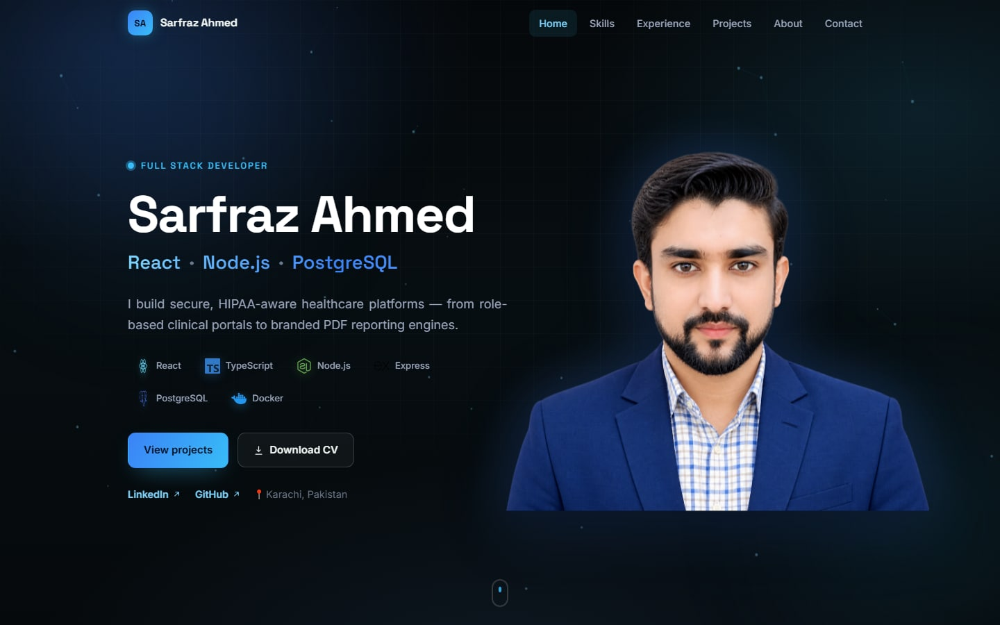

<div align="center">

# Sarfraz Ahmed — Developer Portfolio

**Full-Stack Developer · React · Node.js · PostgreSQL**

A fast, animated, fully responsive single-page portfolio — dark theme, glassmorphism, subtle motion, and an accessible, recruiter-friendly layout.

[](https://sarfrazahmeds.github.io/)
[](https://sarfrazahmeds.github.io/Sarfraz-Ahmed-CV.pdf)
[](https://www.linkedin.com/in/sarfraz-ahmed-725625140)


<br/>



</div>

## 🧭 Overview

This is my personal portfolio — the single page a recruiter or client sees first. It presents my work as a full-stack developer building **secure, HIPAA-aware, multi-tenant healthcare platforms** with React, TypeScript, Node.js and PostgreSQL.

The goal was a site that feels **premium but stays fast, readable and accessible**: a deep‑ink theme with blue accents, glass panels, scroll‑reveal animations, an interactive floating hero photo, and layouts that snap cleanly into every screen size.

**Live:** https://sarfrazahmeds.github.io/

## ✨ Features

- **Single‑page, section‑based layout** — Home, Skills, Experience, Projects, About, Contact — with smooth‑scroll navigation and active‑section highlighting.
- **Animated hero** — a floating, gently‑rotating profile photo inside an orbital ring, with 3D pointer‑parallax tilt.
- **Ambient background** — a lightweight `<canvas>` constellation, layered gradients, grid and a cursor‑following glow.
- **Real technology logos** — official brand marks via `simple-icons`, tree‑shaken so only the used icons ship.
- **Motion done responsibly** — every animation respects `prefers-reduced-motion`, pauses when the tab is hidden, and scales its work to the viewport.
- **Accessible & SEO‑ready** — semantic landmarks, a skip link, keyboard focus states, a single `H1`, and full Open Graph / Twitter cards for rich link previews.
- **One content source** — all text, links, skills, experience and projects live in [`src/data.js`](src/data.js); edit one file to update the whole site.
- **CI/CD** — every push to `main` builds and deploys to GitHub Pages via GitHub Actions.

## 🛠️ Tech Stack

| Area        | Tools |
| ----------- | ----- |
| Framework   | React 19 |
| Build tool  | Vite 8 |
| Styling     | Hand‑written CSS (design tokens, glassmorphism, container queries) |
| Icons       | simple‑icons (official brand SVGs) |
| Linting     | oxlint |
| Deployment  | GitHub Pages + GitHub Actions |

## 📸 Screenshots

<div align="center">


</div>

## 🚀 Getting Started

```bash
# 1. Clone
git clone https://github.com/sarfrazahmedS/sarfrazahmedS.github.io.git
cd sarfrazahmedS.github.io

# 2. Install dependencies
npm install

# 3. Start the dev server (http://localhost:5173)
npm run dev
```

Other scripts:

```bash
npm run build     # production build → dist/
npm run preview   # preview the production build locally
npm run lint      # run oxlint
```

## 📁 Project Structure

```text
.
├── public/                 # Static assets (favicon, images, CV, OG image)
├── src/
│   ├── components/         # UI sections: Nav, Hero, Skills, Experience,
│   │                       #   Projects, About, Contact, Footer, Background, Reveal
│   ├── lib/
│   │   ├── hooks.js        # useReducedMotion, useInView, useActiveSection, useTilt…
│   │   └── techIcons.jsx   # brand-logo resolver (simple-icons)
│   ├── data.js             # single source of truth for all content
│   ├── App.jsx             # composes the sections
│   ├── App.css             # component styles
│   ├── index.css           # design tokens + base styles
│   └── main.jsx            # entry point
├── .github/workflows/      # CI: build + deploy to GitHub Pages
├── screenshots/            # README images
├── index.html
├── vite.config.js
└── package.json
```

## 🌍 Deployment

The site is hosted on **GitHub Pages** and deployed automatically by a **GitHub Actions** workflow ([`.github/workflows/deploy.yml`](.github/workflows/deploy.yml)) on every push to `main`:

1. `npm ci` — install dependencies
2. `npm run build` — produce `dist/`
3. Upload `dist/` and deploy to Pages

Because `vite.config.js` uses `base: './'`, the same build works at any path.

## 📬 Contact

- **Portfolio:** https://sarfrazahmeds.github.io/
- **Email:** sarfrazahmed181@gmail.com
- **LinkedIn:** https://www.linkedin.com/in/sarfraz-ahmed-725625140
- **GitHub:** https://github.com/sarfrazahmedS

## 📄 License

Released under the [MIT License](LICENSE). The code is free to reference and learn from; the personal content, résumé and photographs are © Sarfraz Ahmed.
